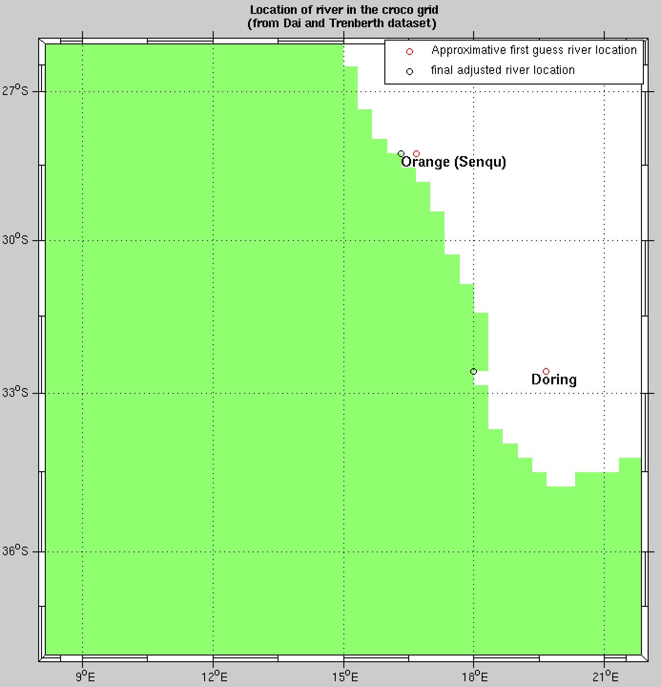
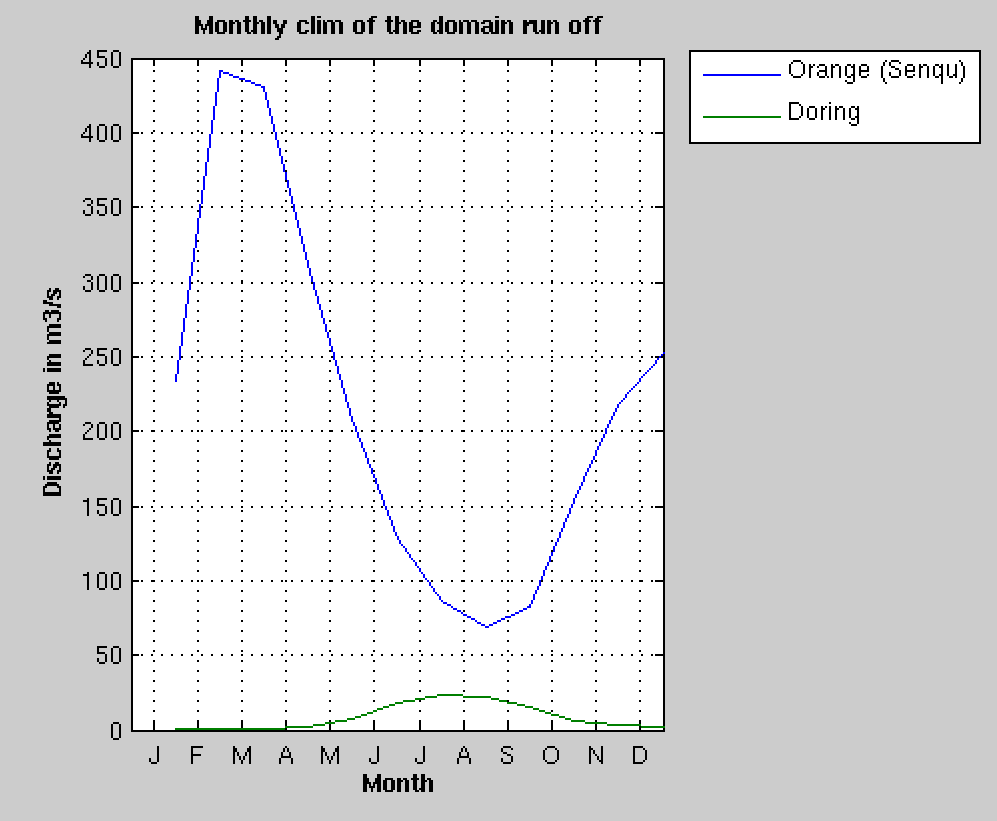
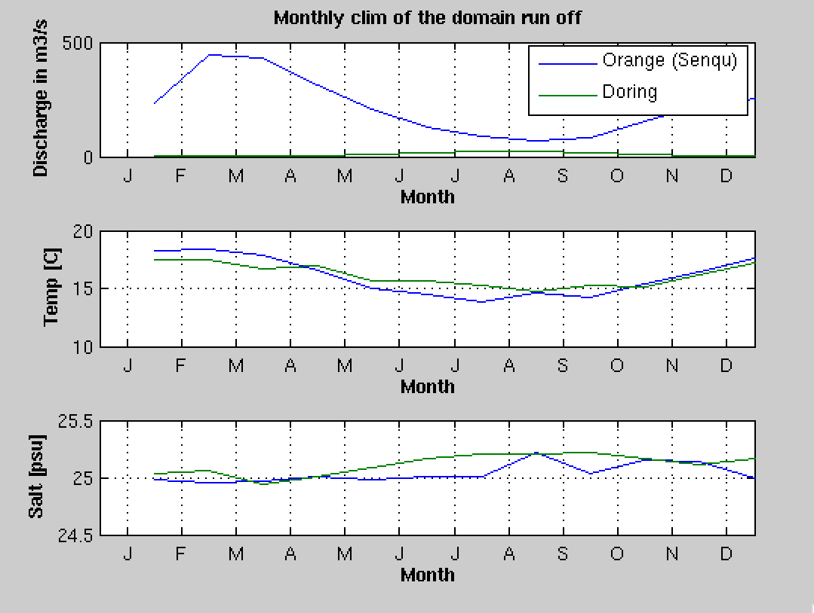

Rivers
======

Create river file for variable flow and constant concentration
##############################################################

In case of variable flow read in a netCDF file you can use in 
``make_runoff`` (Rivers/make_runoff.m) which detect the main rivers 
located in your domain (from **RUNOFF_DAI** runoff climatology). 

.. note:: 
  
  RUNOFF_DAI is a global monthly runoff climatology containing the  925 
  first rivers over the world, from *Dai and Trenberth, 2000*

After asking you some specifications for each detected river in your domain, 
for the selected rivers: 

* It will compute the right location on the croco_grid regarding the 
  direction and orientation you defined
* It will create the river forcing netCDF file croco_runoff.nc containing 
  the various river flow time series.

To do so, in CROCO_TOOLS, edit ``make_runoff.m`` and define the following flags:

::
  
  %% Choose the monthly runoff forcing time and cycle in days

  clim_run=1
  
  %     - times and cycles for runoff conditions:
  %           - clim_run = 1 % climato forcing experiments with climato calendar
  %                     qbar_time=[15:30:365];
  %                     qbar_cycle=360;
  %
  %           - clim_run = 0 % interanual forcing experiments with real calendar
  %                     qbar_time=[15.2188:30.4375:350.0313];
  %                     qbar_cycle=365.25;

::

  psource_ncfile_ts=0;

  %        - psource_ncfile_ts = 0 => Constant analytical runoff tracers concentration no processing
  %                            It reads analytical values in croco.in
  %                            or use default value defined in
  %                            analytical.F

For the BENGUELA test case, you will have 2 rivers detected, Orange and Doring. 
We recommend to define them as zonal (0) and oriented from east to west (-1). 
It will give you the lines to enter in the croco.in file in the psource_ncfile 
section.

::

  psource_ncfile:   Nsrc  Isrc  Jsrc  Dsrc qbardir  Lsrc  Tsrc   runoff file name
                           CROCO_FILES/croco_runoff.nc
                 2
                        25  34  0  -1   30*T   20 15
                        31  19  0  -1   30*T   20 15

where Nsrc=2 is the number of rivers, then each line describe a river. 
Let's describe the parameter for the river #1

* Isr=25, Jsrc=34 are the i, j indices where the river is positioned
* Dsrc=0 indicates the orientation (here zonal) 
* qsbardir= -1 indicates the direction (here towards the west)
* Lstrc=30*T are true/false flags for reading or not the following variables 
  (here temperature and salinity)
* Tsrc=20 15 are respectively the temperature and salinity of the river. 

You can edit these parameters. 

Temperature and salinity can also be variable and read from a netCDF file, 
it is described in the next section.

            First and final guess rivers positions

            Rivers flow seasonal cycle       

.. warning:: 

    The order of the sources in the ``croco.in`` file must match the order of 
    the netcdf file. 
    It's impliticly the case if you generate your runoff file with the 
    croco_tools which give you the lines to add into your croco.in
  

Create river file for variable flow and variable concentration 
##############################################################

You need to prepare your netcdf input file. Using the ``make_runoff.m`` and 
change the following flags:

::

  psource_ncfile_ts=1;

  if psource_ncfile_ts
      psource_ncfile_ts_auto=1 ;
      psource_ncfile_ts_manual=0;
  end

  %        - pource_ncfile_ts = 1  => Variable runoff tracers
  %                                   concentration  processing is activated.
  %
  %        In this case, either choose:
  %           - psource_ts_auto : auto definition 
  %                               using the nearest point in the climatology 
  %                               file croco_clm.nc to fill the tracer 
  %                               concentration time serie in croco_runoff.nc
  %
  %          - psource_ts_manual : manually definition the
  %                                variable tracer concentration to fill 
  %                                the tracer concentration time serie in 
  %                                croco_runoff.nc
  

After asking you some specifications of each detected river in your domain, 
for the selected rivers, in addition to river flow as in previous section, 
it will also put the tracers concentration (temp,salt, no3, et ...) time 
series into the river forcing netCDF file croco_runoff.nc

::

  psource_ncfile:   Nsrc  Isrc  Jsrc  Dsrc qbardir  Lsrc  Tsrc   runoff file name
                           CROCO_FILES/croco_runoff.nc
                 2 
                        25  34  0  -1   30*T   16.0387 25.0368
                        30  19  0  -1   30*T   16.1390 25.1136

You also can edit these parameters. 

.. warning::

  The Tsrc value reported in croco.in are the annual-mean tracer values, 
  the are just for information. The real tracer concentration (Tsrc) are 
  read in the runoff netCDF file created. 

            Rivers tracer concentration seasonal cycle 

Create river file in case of nesting
####################################

The above procedure can be applied to a nested grid. For this, 
edit ``make_runoff`` and change the ``gridlevel`` variable to the adhoc 
grid level.

::

  %Choose the grid level into which you ant to set up the runoffs 
  gridlevel=1
  if ( gridlevel == 0 ) 
    % -> Parent / zoom #O 
    grdname  = [CROCO_files_dir,'croco_grd.nc'];
    rivname =  [CROCO_files_dir,'croco_runoff.nc']
    clmname = [CROCO_files_dir,'croco_clm.nc'];    % <- climato file for runoff
  else 
    %  -> Child / zoom #XX
    grdname  = [CROCO_files_dir,'croco_grd.nc.',num2str(gridlevel)];
    rivname =  [CROCO_files_dir,'croco_runoff.nc.',num2str(gridlevel)];
    clmname = [CROCO_files_dir,'croco_clm.nc.',num2str(gridlevel)]; % <- climato file for runoff
  end

and run ``make_runoff`` again to generate 

::

  croco_runoff.nc.1

