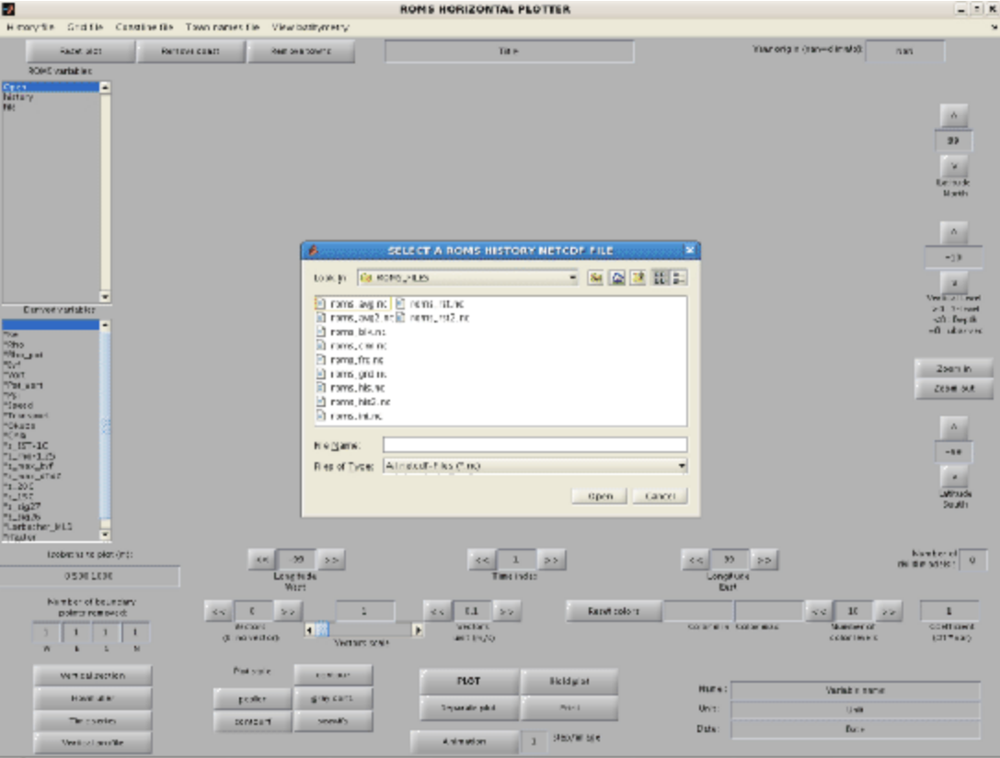
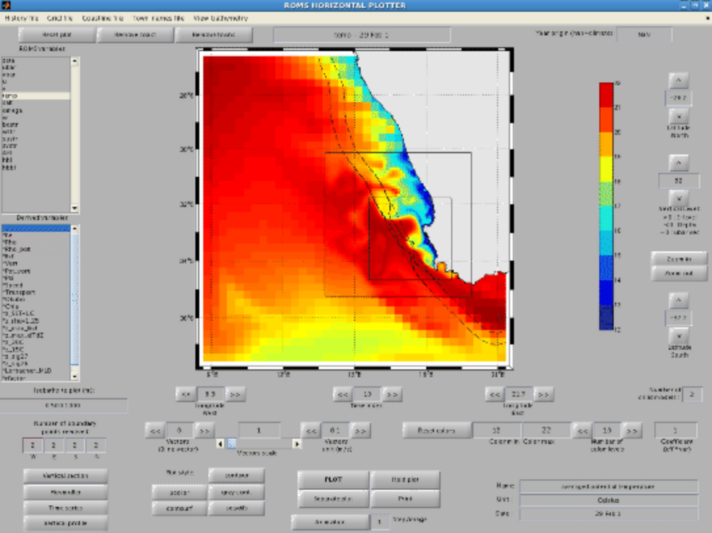

Visualization
=============

The ``croco_gui`` utility has been developped under Matlab software to 
visualize CROCO outputs. 

In Matlab
::

    start
    croco_gui

A window pops up, asking for a CROCO history NetCDF file 
(see screen captions below). You should select croco_his.nc (history file) 
or croco_avg.nc (average file) and click “open”.

The main window appears, variables can be selected to obtain an image such 
as Figure below. On the left side, the upper box gives the available CROCO 
variable names and the lower box presents the variables derived from the 
CROCO model outputs :

* Ke : Horizontal slice of kinetic energy 
* Rho : Horizontal slice of density using the non-linear equation of state 
  for seawater of Jackett and McDougall (1995)
* Pot_Rho : Horizontal slice of the potential density
* Bvf : Horizontal slice of the Brunt-Väisäla frequency
* Vort : Horizontal slice of vorticity
* Pot_vort : Horizontal slice of the vertical component of Ertel’s potential 
  vorticity. In our case, :math:`\lambda=\rho`
* Psi : Horizontal slice of stream function. This routine might be costly 
  since it inverses the Laplacian of the vorticity (using a successive over 
  relaxation solver)
* Speed : Horizontal slice of the ocean currents velocity 
* Transport : Horizontal slice of the transport stream function
* Okubo : Horizontal slice of the Okubo-Weiss parameter
* Chla : Compute a chlorophyll-a from Large and Small phytoplankton 
  concentrations
* z_SST_1C : Depth of 1°C below SST
* z_rho_1.25 : Depth of 1.25 kg/m^3 below surface density
* z_max_bvf : Depth of the maximum of the Brunt-Väisäla frequency
* z_max_dtdz : Depth of the maximum vertical temperature gradient
* z_20C : Depth of the 20°C isotherm
* z_15C : Depth of the 15°C isotherm
* z_sig27 : Depth of the 1027 kg/m^3 density layer

It is possible to add arrows for the horizontal currents by increasing the 
“Current vectors spatial step”. It is also possible to obtain vertical 
sections, time series, vertical profiles and Hovmüller diagrams by clicking 
on the corresponding targets in croco_gui.

